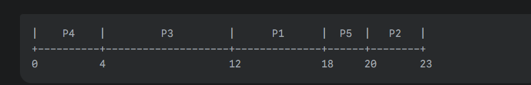

### Bài 1:
### FCFS với thời gian đến khác nhau
### Cho các tiến trình có thời gian đến khác nhau, hãy lập lịch bằng FCFS:
### (p1,p2,p3,p4,p5)-----AT(2,5,1,0,4)----BT(6,3,8,4,2)

### (Turnaround Time = Finish Time – Arrival Time)

### Lập lịch
| Process | Arrival | Burst | Start | Finish Time | Waiting Time | Turnaround Time |
| ------- | ------- | ----- | ----- | ------ | ------------ | --------------- |
| P4      | 0       | 4     | 0     | 4      | 0            | 4               |
| P3      | 1       | 8     | 4     | 12     | 3            | 11              |
| P1      | 2       | 6     | 12    | 18     | 10           | 16              |
| P5      | 4       | 2     | 18    | 20     | 14           | 16              |
| P2      | 5       | 3     | 20    | 23     | 15           | 18              |

### Tính 
- CT = FT = 23s.  
- TAT = 18s .  
- Nếu **Arrival Time bằng nhau**, thì chọn **tiến trình xuất hiện trước trong danh sách** (hoặc có **ID nhỏ hơn**).

|0|----P4----|4|--------P3--------|12|----P1----|18|--P5--|20|--P2--|23|

Average Waiting Time = (0 + 3 + 10 + 14 + 15) / 5 = 42 / 5 = 8.4
Average Turnaround Time = (4 + 11 + 16 + 16 + 18) / 5 = 65 / 5 = 13.0

### Biểu đồ gantt
