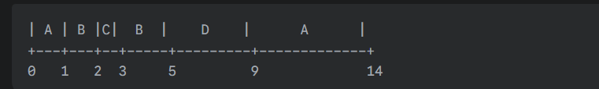

# Bài 3 — SJF có độc quyền (SRTF)

**Đề bài:**
Cho các tiến trình `(A, B, C, D)` với
`AT = (0, 1, 2, 3)` và `CPU cycle (BT) = (6, 3, 1, 4)`
(Yêu cầu: lập lịch bằng SRTF — Shortest Remaining Time First, tức SJF có preemption)

**Ghi nhớ:**
- Completion Time (CT) = thời điểm tiến trình hoàn thành
- Turnaround Time (TAT) = CT − AT
- Waiting Time (WT) = TAT − BT

---

## Kết quả (SRTF scheduling)

| Process | AT | BT | Start (first) | CT (Completion) | Turnaround (CT − AT) | Waiting (TAT − BT) |
|:---:|---:|---:|:---:|:---:|:---:|:---:|
| A | 0 | 6 | 0 | 14 | 14 | 8 |
| B | 1 | 3 | 1 | 5 | 4 | 1 |
| C | 2 | 1 | 2 | 3 | 1 | 0 |
| D | 3 | 4 | 5 | 9 | 6 | 2 |

**Trung bình:**
- **Average Waiting Time** = (8 + 1 + 0 + 2) / 4 = 11 / 4 = **2.75**
- **Average Turnaround Time** = (14 + 4 + 1 + 6) / 4 = 25 / 4 = **6.25**
- **Makespan (thời điểm hoàn thành cuối)** = CT_max = **14**

---

## Biểu đồ Gantt (ASCII)

Biểu đồ này minh họa quá trình thực thi và các thời điểm CPU chuyển đổi (preemption).